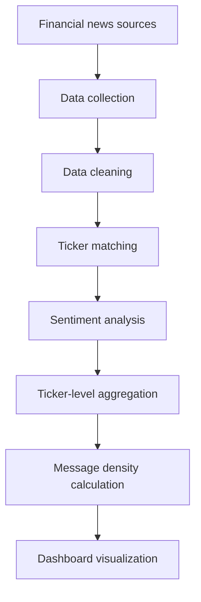

# Financial News Sentiment Analysis Dashboard
> **IST 495 Summer 2026** — internship project (remote).  
> Main language: **Python** · Repository: **fin-news-sentiment**
## Project description
This project builds a **Python-based financial news sentiment analysis and stock ticker ranking system**.
The system will:
- Collect financial news related to stock tickers  
- Analyze the sentiment of each news item  
- Calculate **message density**  
- Display **ranked tickers** in a dashboard  
The final dashboard is planned to work like a **stock screener**: users can view ticker-level sentiment scores, recent news activity, and related articles.
The work ties to the internship theme of using **generative AI** and **agentic AI** to analyze financial news and stock-related information. The stack may include AI-assisted tooling (e.g. ChatGPT, Microsoft Copilot, Gemini, Claude, CrewAI, or other agent builders) for coding, prompt design, and workflow automation.
---
## Main goals
1. Collect financial news from online sources, RSS feeds, or other financial news platforms  
2. Clean and organize collected news data  
3. Identify related stock tickers from titles, summaries, or article body  
4. Analyze sentiment for each financial news item  
5. Calculate ticker-level sentiment scores  
6. Calculate **message density** per ticker (volume of related news)  
7. Rank tickers using sentiment and news activity  
8. Build a dashboard for ranked tickers, scores, density, and recent news  
9. Document the project so others can run it on a separate machine  
---
## Planned project structure
```
fin-news-sentiment/
├── README.md
├── requirements.txt
├── data/
│   ├── datasets/          # local copies of benchmark sentiment corpora (see data/datasets/README.md)
│   ├── raw/
│   └── processed/
├── src/
│   ├── collect_news.py
│   ├── clean_data.py
│   ├── sentiment_analysis.py
│   ├── ticker_ranking.py
│   └── dashboard.py
├── notebooks/
│   └── exploration.ipynb
└── reports/
    └── weekly_updates/
```
### Folder descriptions
| Path | Purpose |
|------|--------|
| **`data/datasets/`** | Curated **labeled** finance sentiment datasets for modeling / evaluation (not live RSS news). |
| **`data/raw/`** | Original collected news before cleaning. Example: `raw_news_data.csv` |
| **`data/processed/`** | Cleaned / analysis-ready data. Examples: `cleaned_news_data.csv`, `sentiment_results.csv`, `ticker_ranking.csv`, `final_dataset.csv` |
| **`src/`** | Main Python modules (see below) |
| **`notebooks/`** | Exploratory work. `exploration.ipynb` — tests for cleaning, sentiment, and visualizations |
| **`reports/weekly_updates/`** | Weekly internship updates (completed work, challenges, next steps, deliverables) |
### Planned `src/` modules
| File | Role |
|------|------|
| `collect_news.py` | Collect financial news (RSS or other sources) |
| `clean_data.py` | Clean raw data for analysis |
| `sentiment_analysis.py` | Sentiment per news item |
| `ticker_ranking.py` | Ticker-level scores and message density |
| `merge_data.py` | Merge stock screener data with sentiment rankings |
| `run_pipeline.py` | Run the full pipeline with one command |
| `dashboard.py` | Run the dashboard app |
| `dataset_loaders.py` | Load benchmark CSV/txt corpora from `data/datasets/` into a common `text` / `label` schema |
---
## Labeled benchmark datasets (local)

Three local corpora are organized under `data/datasets/`:

- **Financial PhraseBank v1.0** — sentence-level labels (`Sentences_AllAgree.txt`, plus other agreement cuts).
- **`all-data.csv`** — two-column file (`label`, `sentence`) for supervised sentiment.
- **`SEntFiN-v1.1.csv`** — headlines with JSON entity sentiments in `Decisions` (loader derives a simple headline-level label by **majority vote** over entities).

Details, paths, and citation reminders: `data/datasets/README.md`.  
Quick smoke test (from repo root): `python -m src.dataset_loaders`

---
## Tools and technologies
- Python  
- pandas  
- requests  
- BeautifulSoup  
- feedparser  
- nltk or VADER  
- Hugging Face models or FinBERT  
- Streamlit  
- GitHub  
- AI tools (ChatGPT, Copilot, Gemini, Claude, CrewAI, etc.)  
---
## Planned workflow

---
## Data collection plan
Start from accessible sources (RSS, public financial news pages), including market and stock-related feeds.
**Planned fields:**
- News title  
- Summary or article text  
- Published time  
- Source name  
- URL  
- Related stock ticker  
---
## Sentiment analysis plan
1. Start with a **simple baseline** (e.g. VADER, TextBlob).  
2. After the baseline works, optionally try **finance-specific** models (e.g. FinBERT, other transformers).  
**Per-item labels:** Positive · Neutral · Negative  
**Optional:** store a continuous **sentiment score** per item.
---
## Ticker ranking plan
**Possible ticker-level metrics:**
- Average sentiment score  
- Count of related news articles  
- Positive / negative news ratios  
- Message density  
- Latest sentiment score  
**Example ranking table:**
| Ticker | Average sentiment | News count | Message density | Rank |
|--------|-------------------|------------|-----------------|------|
| AAPL | 0.35 | 20 | High | 1 |
| TSLA | -0.20 | 35 | High | 2 |
| NVDA | 0.50 | 18 | Medium | 3 |
---
## Dashboard plan
**Planned UI content:**
- Ranked tickers  
- Sentiment scores  
- Message density  
- Recent news articles  
- Sentiment distribution charts  
- Filters: ticker, source, time range  
**Framework:** Streamlit (planned).
---
## How to run
Instructions will be updated as the project grows.
**Setup (planned):**
```bash
pip install -r requirements.txt
```
**Dashboard (planned):**
```bash
streamlit run src/dashboard.py
```
---
## Current status
**Stage:** Production pipeline — Finviz Elite 20-stock screener, per-ticker news, VADER sentiment, merge, Streamlit dashboard (demo optional for offline dev).

### Completed
- [x] GitHub repository and project structure
- [x] Finviz stock collection (`collect_stocks.py`)
- [x] Per-ticker news collection — Google, Yahoo, Finviz (`collect_news.py`)
- [x] Data cleaning with HTML stripping (`clean_data.py`)
- [x] VADER baseline sentiment (`sentiment_analysis.py`)
- [x] Ticker ranking and message density (`ticker_ranking.py`)
- [x] Stock + sentiment merge (`merge_data.py`)
- [x] One-command pipeline runner (`run_pipeline.py`)
- [x] Streamlit dashboard with filters, charts, and news viewer (`dashboard.py`)
- [x] Benchmark dataset loaders (`dataset_loaders.py`)
- [x] Weekly updates (weeks 1–4)

### Next steps
- [ ] Review VADER eval report; consider FinBERT if accuracy is low
- [ ] Social news sources (Stocktwits) per professor roadmap
- [ ] Redis caching for faster refresh
- [ ] Add automated tests for parsers and merge logic
---
## Internship information
| Item | Detail |
|------|--------|
| Course | IST 495 Summer 2026 Internship |
| Topic | Financial News Sentiment Analysis |
| Student | Jinyang Liu |
| Repository | fin-news-sentiment |
| Work mode | Remote |
| Language | Python |
---
## Quick start (production)

### 1. Setup

```bash
python -m venv .venv
source .venv/bin/activate   # Windows: .venv\Scripts\activate
pip install -r requirements.txt
cp .env.example .env
```

Add your **Finviz Elite API token** to `.env`:

```bash
FINVIZ_API_TOKEN=your-token-here
```

Get the token from: https://elite.finviz.com/api_explanation

### 2. Run pipeline (default: 20-stock Technical screener)

```bash
python -m src.run_pipeline --evaluate
streamlit run src/dashboard.py
```

This runs:
1. Finviz Elite export — professor Technical filters (`change up`, high volume)
2. News per ticker — Finviz Elite + Google + Yahoo + SEC
3. Clean → VADER sentiment → rank → merge → `final_dataset.csv`
4. VADER benchmark evaluation → `vader_eval_report.csv`

Optional MongoDB: `python -m src.run_pipeline --evaluate --mongo`

### Step by step

```bash
python -m src.collect_stocks --elite --top-n 20
python -m src.collect_news --from-stocks --top-n 20
python -m src.clean_data
python -m src.sentiment_analysis
python -m src.ticker_ranking
python -m src.merge_data
streamlit run src/dashboard.py
```

### Offline demo (development only)

```bash
python -m src.run_pipeline --demo
```

---
## Notes
This project is **under development**. This README will be updated during the internship as code, data pipelines, and dashboard features are added.
